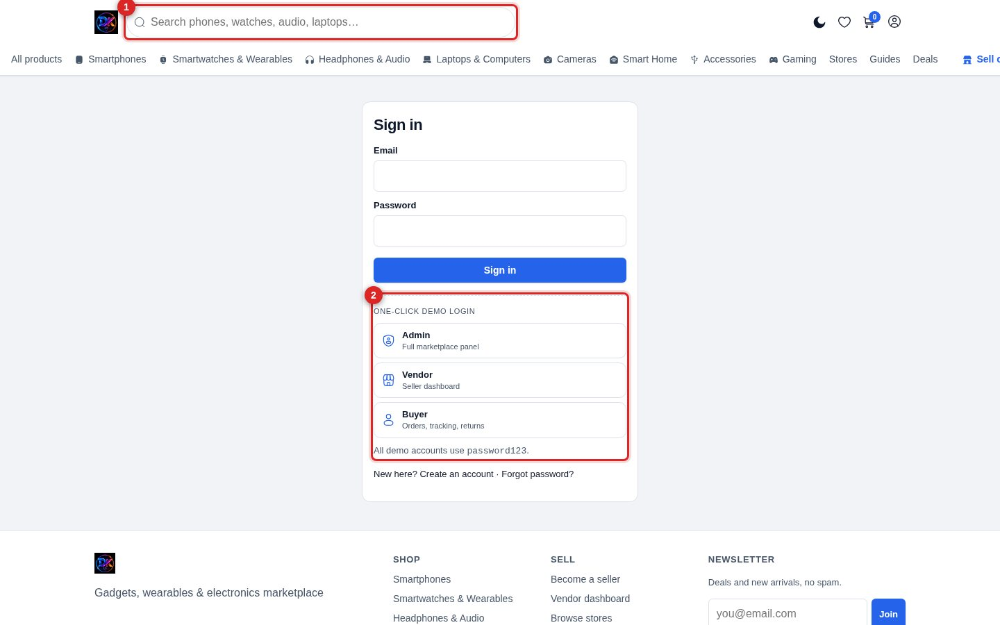

[← Docs index](README.md)

# 1 — Installation

## Requirements

| Need | Detail |
|---|---|
| PHP | 8.1 or newer |
| Extensions | `pdo_sqlite` (required) default enabled mostly, `curl` (payments/AI), `zip` (zip backups), `gd` (optional) |
| Server | Apache/LiteSpeed with `mod_rewrite`, or PHP's built-in server for testing |
| Database | None to install — SQLite lives in `db/voltra.sqlite` |

No Composer. No npm. No build step. There is nothing to compile.

## Install

1. upload the provided zip on your file manager in public HTML folder **Unzip** the archive and upload the contents to your web root
   (`public_html`, `htdocs`, or similar).
2. Make sure `uploads/` and `db/` permission are **writable** by PHP (usually `755`, some
   hosts need `775`). and also make sure if you open public html folder you will see index.php in that folder 📁 
3. Open your domain in a browser go to login login with default admin credentials and change password from security settings after login
4. if you want to start from scratch you can reset the site from setting> backup and reset when you don this all data img post page product will be deleted then you need to create new one by one
5. I recommend to delete post page and products from bulc select option and start working on that 

That's it. A seeded demo database ships inside the zip, so the site works
immediately — you do **not** need to run an installer.

### Resetting to factory demo data

```bash
php db/seed.php
```

This wipes and rebuilds the demo catalogue, vendors and orders. Only use it on
a fresh install — it will destroy real data.

### Running locally

```bash
php -S 0.0.0.0:8080 router.php
```

`router.php` emulates the `.htaccess` rewrites so pretty URLs work with PHP's
built-in server.

## First login



1. **Normal login** — email and password.
2. **One-click demo buttons** — Admin, Vendor and Buyer. These submit a normal
   form post, so they go through the same CSRF and password checks as a typed
   login. They work with JavaScript disabled.

Log in as **Admin** to reach `/admin/`.

## Going live — checklist

Work through this before you accept a real order:

- [ ] **Settings → Commerce** → turn **off** "Show one-click demo logins"
- [ ] Change the password on every demo account (**Users**)
- [ ] Delete or rename the demo accounts you do not need
- [ ] **Settings → Site identity** → your name, logo, favicon
- [ ] **Settings → Payments** → real Razorpay/PayPal keys, switch off sandbox
- [ ] **Settings → Email** → your SMTP credentials, send a test
- [ ] **Settings → Commerce** → currency, commission rate, minimum payout
- [ ] Replace the demo products, vendors and banners with your own
- [ ] Take a backup (**Settings → Backup**)

## Security notes

These are already handled, but worth knowing:

- `db/` is blocked at the web server (`.htaccess` + a deny rule). Requesting
  `/db/voltra.sqlite` returns **403**.
- PHP execution is disabled inside `uploads/`, so an uploaded `.php` file
  cannot run.
- Every form is CSRF-protected; AJAX sends an `X-CSRF-Token` header.
- Payment callbacks are verified server-side — a browser redirect is never
  trusted on its own.

---

[Next: Admin tour →](02-admin-tour.md)
