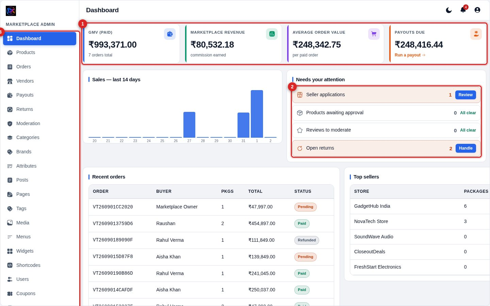
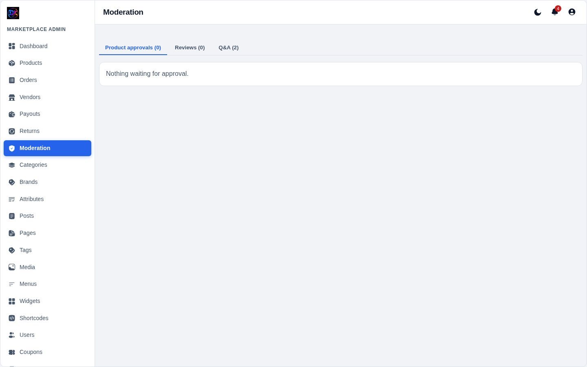
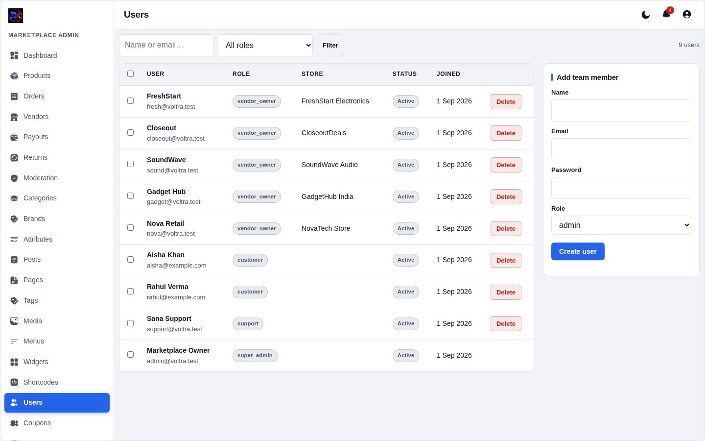
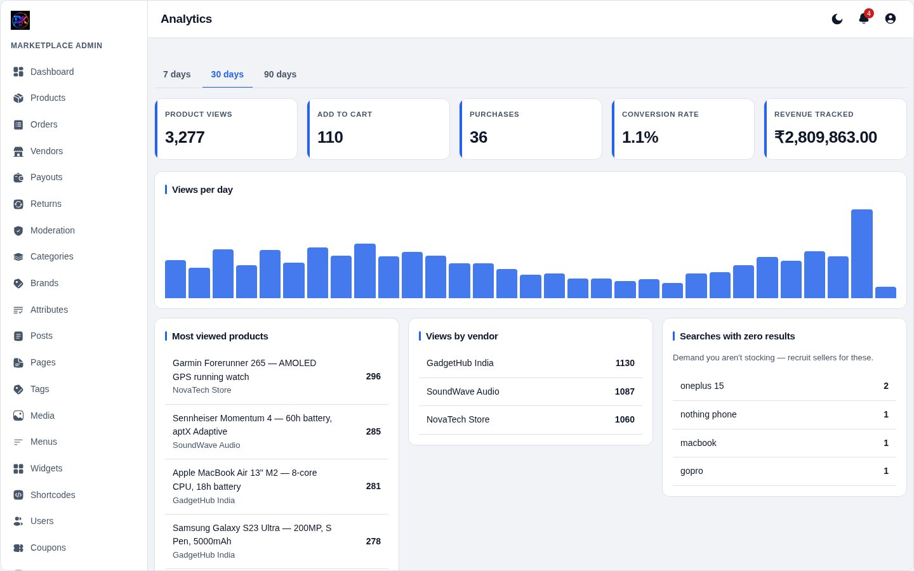

[← Docs index](README.md)

# 2 — Admin tour

## The dashboard

**1 — KPI cards.** Gross merchandise value (paid orders only), your commission
earned, average order value, and payouts owed to sellers. Each has its own
accent colour so you can find one at a glance.

**2 — Needs your attention.** A live to-do list. Anything above zero turns
**amber** and gets a button straight to the fix. Anything at zero says
"All clear" and stays quiet — a zero here is good news, so it does not shout.

**3 — Sidebar.** Every section of the panel. Items you lack permission for are
hidden entirely, not greyed out.

Below the fold: a 14-day sales chart, recent orders, top sellers by package
count, and low-stock alerts.

## Reading the colour language

The panel uses one rule consistently:

> **Soft tinted background = information.**
> **Solid saturated fill = the thing you click.**

So a *Pending* pill is a tinted amber chip (it tells you something), while
**Mark paid** is a solid blue button (it does something). Destructive actions
stay tinted red until you hover, then commit to full red.

## Notifications

The bell in the top bar shows unread count. Opening a notification marks just
that one as read and the badge drops by one — there is also **Mark all read**.

## Who can see what

Capabilities are enforced server-side on every page and every AJAX call, not
just hidden in the UI.

| Role | Can reach |
|---|---|
| `super_admin` | Everything |
| `admin` | Everything except user role changes |
| `support` | Orders, returns, moderation — **not** payouts or settings |
| `vendor_owner` | Only `/vendor/`, scoped to their own store |
| `customer` | Storefront and their own account |

A vendor who requests another vendor's order gets a **403**, not an empty page.

## Moderation queue

Products, reviews and questions awaiting approval, in one place. Approve or
reject in a click. If a vendor has **auto-approve** on, their products skip
this entirely.

## Users and roles

Every account with its role. Change a role here — capability checks apply
immediately on the next request, server-side.

## Analytics

Product views, add-to-carts, purchases and **zero-result searches**. That last
one is the most useful: it tells you what buyers wanted and you did not stock.

## Sections at a glance

| Section | Use it for |
|---|---|
| Products | Catalogue, variants, stock |
| Orders | Every order, package-level fulfilment |
| Vendors | Seller applications, KYC, commission overrides |
| Payouts | Paying sellers what they have earned |
| Returns | RMA requests |
| Moderation | Products, reviews and questions awaiting approval |
| Categories / Brands / Attributes | Catalogue structure and filter facets |
| Posts / Pages | Blog and static pages |
| Media | Every uploaded file |
| Menus / Widgets / Shortcodes | Storefront layout |
| Banner slider | Homepage carousel |
| Coupons | Discount codes |
| Ads & Sponsored | Banner ads and paid listing placements |
| Shipping | Zones and rates |
| Analytics | Views, add-to-carts, purchases, zero-result searches |
| Users | Accounts and roles |
| Settings | Everything else |

---

[← Installation](01-installation.md) · [Next: Products →](03-products.md)
