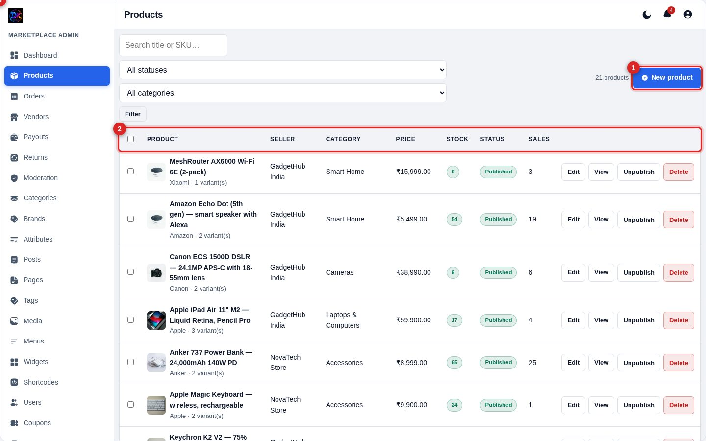
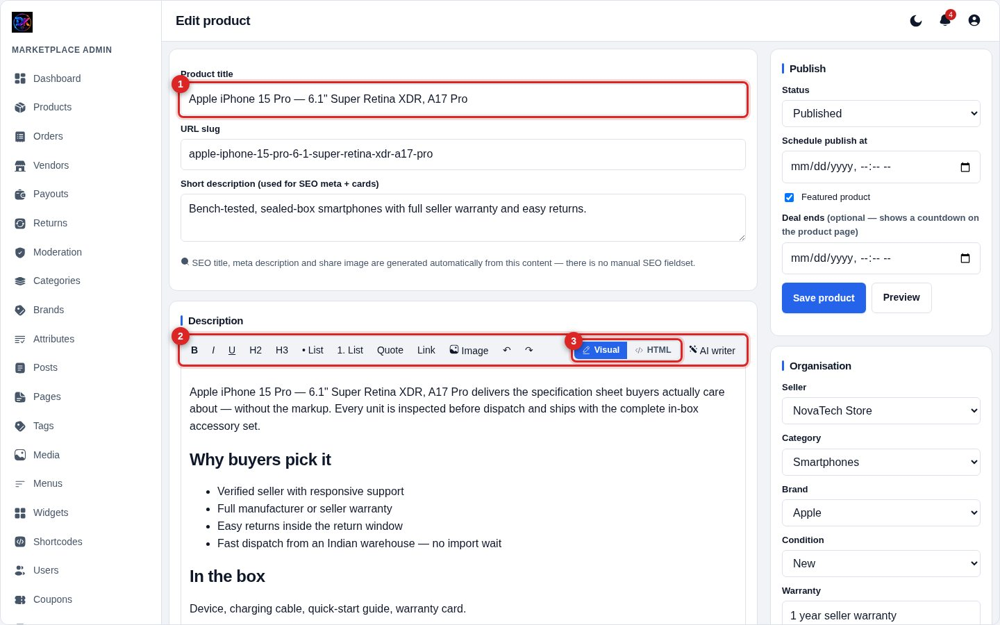
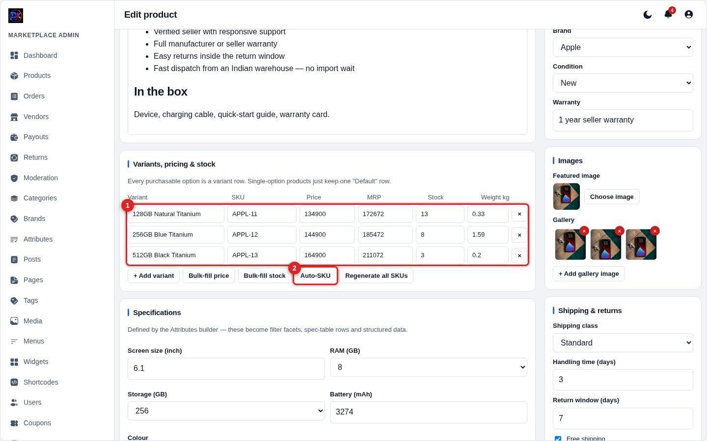
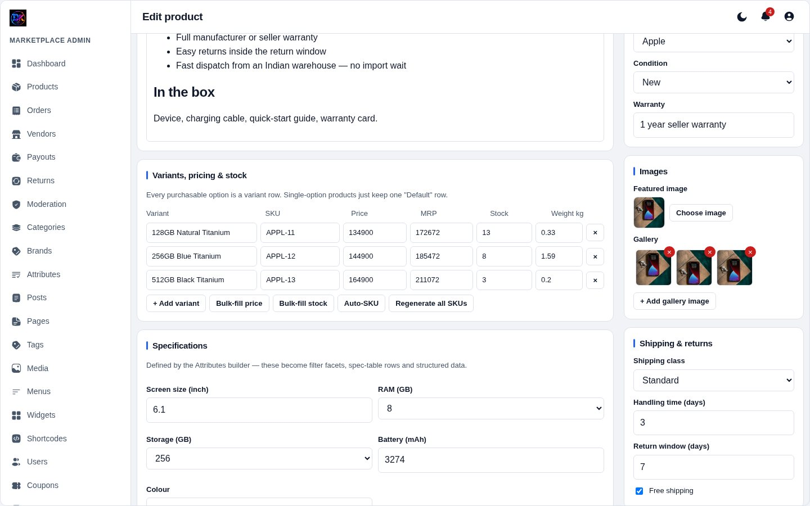

[← Docs index](README.md)

# 3 — Products

## The product list

**1 — Add product.** Opens an empty editor.
**2 — Column headers.** Click to sort.
**3 — Bulk bar.** Tick rows and it appears — publish, unpublish or delete in
one go.

Each row shows the thumbnail, title, seller, price, stock and status. **View**
opens the live product page in a new tab.

## Adding a product

**1 — Product title.** The URL slug fills itself from the title. You can edit
it, but changing it on a live product changes its URL — old links will 404, so
only do it before publishing.

**2 — Description toolbar.** Bold, italic, headings, lists, quotes, links,
images, and the **AI writer**.

**3 — Visual / HTML toggle.** Switch between the rich editor and raw HTML.
Content is copied across on every switch, so the two can never drift apart. In
HTML mode the formatting buttons are disabled — they do nothing useful on a
textarea.

> **There is no SEO fieldset.** The meta title, description, Open Graph tags
> and structured data are all generated from the title, short description and
> body. See [SEO](10-seo.md).

### Short description

Used for the meta description **and** the product card excerpt. Keep it under
about 160 characters. If you leave it blank, the system falls back to the first
part of the body.

## Variants, pricing and stock

**1 — Variant rows.** Every purchasable option is a row: title, SKU, price,
MRP, stock, weight. A product with no options just keeps one row called
"Default".

**2 — Auto-SKU.** Generates SKUs from the product and variant names
(`APPL-11`, `APPL-12`…). Duplicates are flagged **red as you type**, and the
server de-duplicates case-insensitively on save — it adds a suffix rather than
refusing the save.

Other buttons:

| Button | Does |
|---|---|
| **+ Add variant** | New empty row |
| **Bulk-fill price** | Same price into every row |
| **Bulk-fill stock** | Same stock into every row |
| **Regenerate all SKUs** | Overwrites every SKU, even filled ones |

**MRP** is the struck-through "was" price. Set it higher than price and the
card automatically shows a discount badge. Leave it equal (or empty) for no
badge.

**Stock** drives the storefront: `0` shows *Out of stock* and disables the
buy button; `1–3` shows *Only N left*. Anything higher shows nothing at all —
a green "In stock" on every card is noise.

## Images, publishing and deal timers

**Featured image** is the card thumbnail and the social share image.
**Gallery** images appear as thumbnails on the product page. Use **Choose
image** to pick from the media library or upload on the spot.

**Status** — Draft, Pending or Published. **Schedule publish at** sets a future
go-live date.

**Deal ends** is the countdown. Set a date and time and the product page shows
a live timer (days/hours/minutes/seconds) that removes itself when the offer
expires. Leave it blank for no timer.

**Shipping & returns** — shipping class, handling days, return window, and a
free-shipping flag for this product.

## Specifications

Driven by the **Attributes** builder. Whatever you define there appears here as
fields, and those values become filter facets on the shop page, rows in the
spec table, and structured data for search engines.

## Moderation

If a vendor submits a product, it lands in **Moderation** as *Pending*. Approve
or reject it there. You can let a trusted vendor skip this — see
[Vendors](05-vendors-payouts.md).

---

[← Admin tour](02-admin-tour.md) · [Next: Orders & tracking →](04-orders.md)
