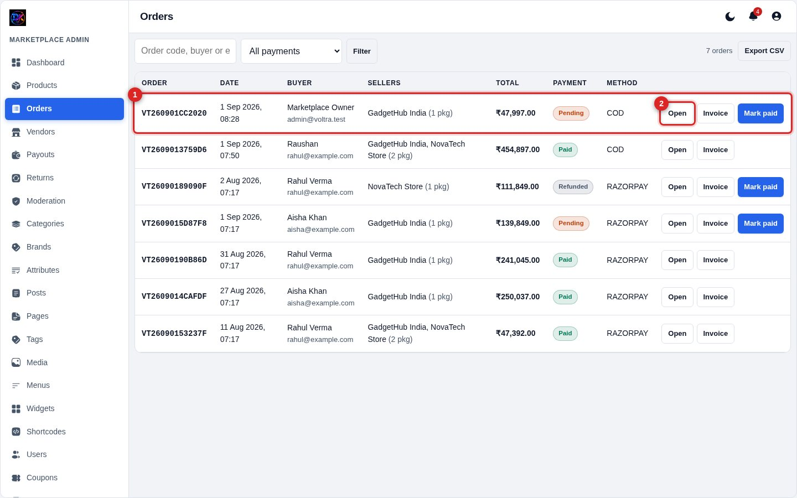
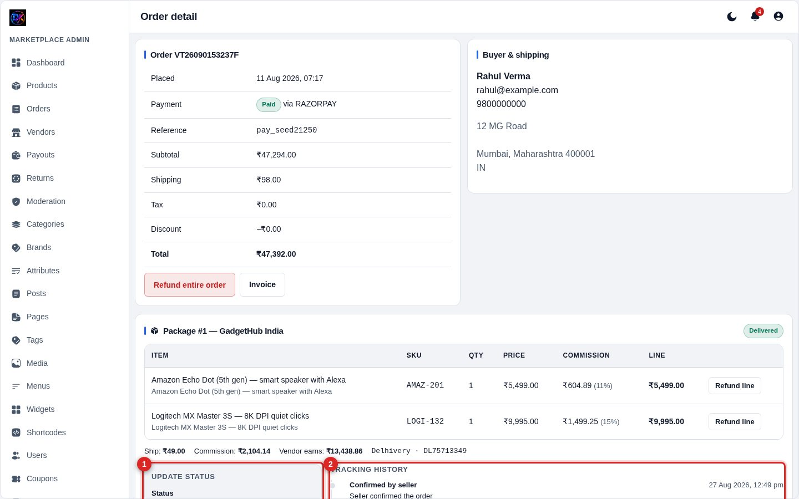
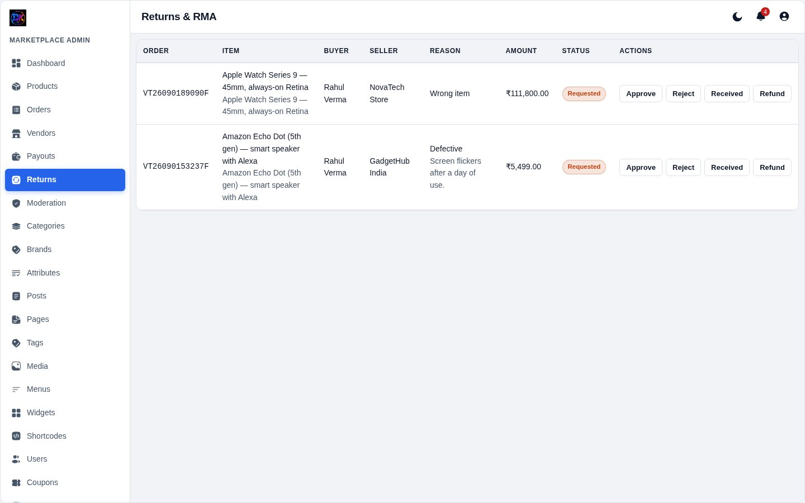

[← Docs index](README.md)

# 4 — Orders & tracking

## How an order is structured

This is the one concept worth understanding before anything else:

> One cart → one payment → **one order** → **one package per seller**.

If a buyer orders from three vendors, they pay once and get **one order** with
**three packages**. Each package ships separately, has its own delivery
estimate, its own fulfilment status, and its own commission line. Package
subtotals always add up to what the buyer was charged.

## The orders list

**1 — Order rows.** Code, date, buyer, which sellers are involved, total,
payment status and method.

**2 — Open.** The order detail page. **Invoice** produces a printable invoice.
**Mark paid** appears only on unpaid orders — that is the solid blue button,
because it is the action.

Filter by payment status or search by order code, buyer name or email.
**Export CSV** gives you the filtered set.

## Order detail and shipment updates

The top of the page shows totals, the buyer's address, and order-level actions.
Below that, **one block per package**.

**1 — Update status.** Everything about a shipment in one form:

| Field | Notes |
|---|---|
| **Status** | Confirmed → Packed → Shipped → Delivered (or Cancelled) |
| **Carrier** | Only shown once you pick Shipped |
| **Tracking no.** | Same |
| **Location** | Optional, e.g. "Bhiwandi hub" |
| **Note to buyer** | Optional, visible to the customer |

**Save status** applies the change. **Add note only** records an update
*without* changing the status — useful for "Held at hub for address check".

**2 — Tracking history.** Every change and note, appended in order. This table
is **append-only** — nothing is overwritten, so you always have the full audit
trail. The buyer sees the same history in their account, minus staff names.

### What each status does

| Status | Effect |
|---|---|
| Confirmed | Seller has accepted the order |
| Packed | Ready to hand to the courier |
| **Shipped** | Emails the buyer the carrier + tracking number |
| **Delivered** | Starts the return window; releases the seller's earnings. For COD, credits the ledger |
| Cancelled | Restocks the items |

Marking a package delivered twice does **not** pay the seller twice.

## Refunds

**Refund line** refunds a single item; **Refund entire order** does the lot.
Either way the ledger reverses *both* the sale credit and the commission debit,
so your books stay correct.

## Returns

Buyers request a return from their account inside the return window. Requests
appear here as *Requested* — approve, reject, or mark received. Approving links
the refund back to the original order line.

---

[← Products](03-products.md) · [Next: Vendors & payouts →](05-vendors-payouts.md)
