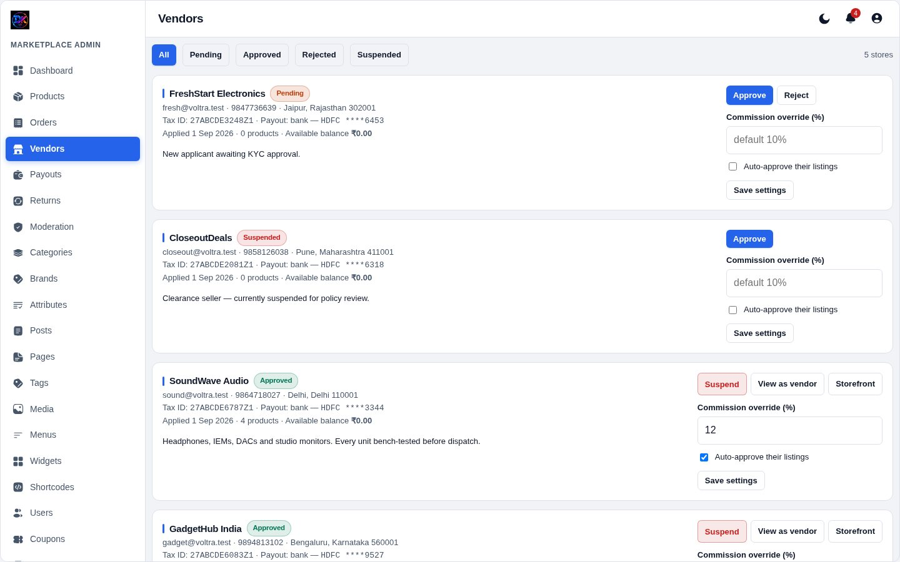
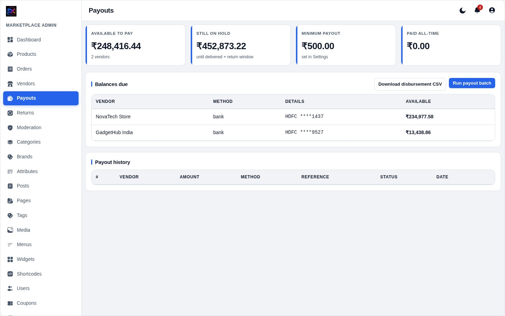

[← Docs index](README.md)

# 5 — Vendors & payouts

## Approving sellers

Someone applies through **Sell with us** on the storefront and lands here as
*Pending*. Open the application to review their business details, tax ID and
payout method, then set **KYC status**:

| Status | Means |
|---|---|
| Pending | Applied, cannot sell yet |
| **Approved** | Can list products and receive orders |
| Rejected | Application refused |
| Suspended | Was approved, now blocked — their store 404s |

### Per-vendor settings

**Commission rate** overrides the site default for this seller. Leave it blank
to use the global rate.

**Auto-approve** lets a trusted seller publish without going through
Moderation. Off by default.

## How the money works

This is the part worth reading carefully.

`vendor_ledger` is an **append-only** table of signed rows:

| Type | Sign | When |
|---|---|---|
| `sale` | + | Order paid |
| `commission` | − | Order paid |
| `refund` | − | Item refunded |
| `refund_commission` | + | Item refunded (gives the commission back) |
| `payout` | − | You pay the seller |

A seller's balance is **always `SUM(ledger)`** — never a stored number that can
drift out of sync. Rows are never edited or deleted; a correction is a new row.

Each row is in one of two states:

- **`pending`** — order paid but not yet delivered
- **`available`** — delivered, ready to pay out

Earnings move from pending to available when a package is marked **Delivered**.
For COD orders that is also the moment the sale is credited at all.

## Running a payout

The page lists each seller's available balance. Sellers below the **minimum
payout** (Settings → Commerce) are not shown.

1. Pick the seller and check the amount.
2. Pay them through your bank/UPI **outside the system**.
3. Record the payout here with the reference number.

Recording it flips those ledger rows to `paid` and writes a balancing negative
row, so the balance drops to zero and the history stays intact. Nothing is
deleted.

> Voltra does **not** move money by itself. It tells you exactly what to pay
> and keeps the record; the transfer is yours to make.

## Vendor earnings view

Sellers see the same numbers from their side — pending, available, paid to
date, and every ledger line — in **Vendor → Earnings**. Because both sides read
the same table, your figures and theirs can never disagree.

---

[← Orders](04-orders.md) · [Next: Storefront content →](06-content.md)
