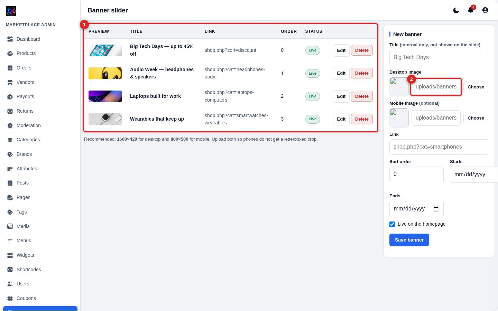
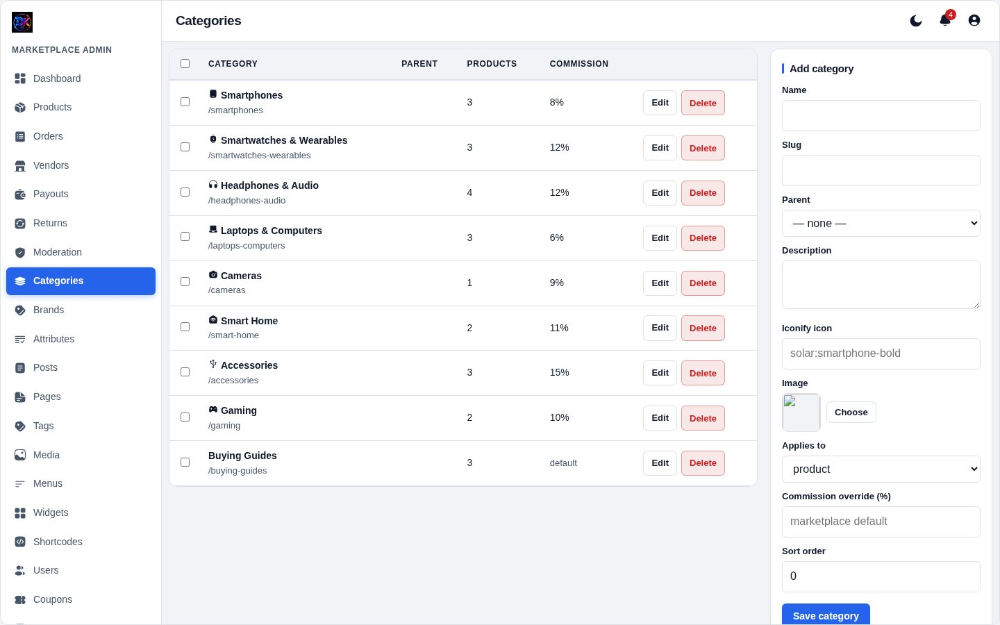
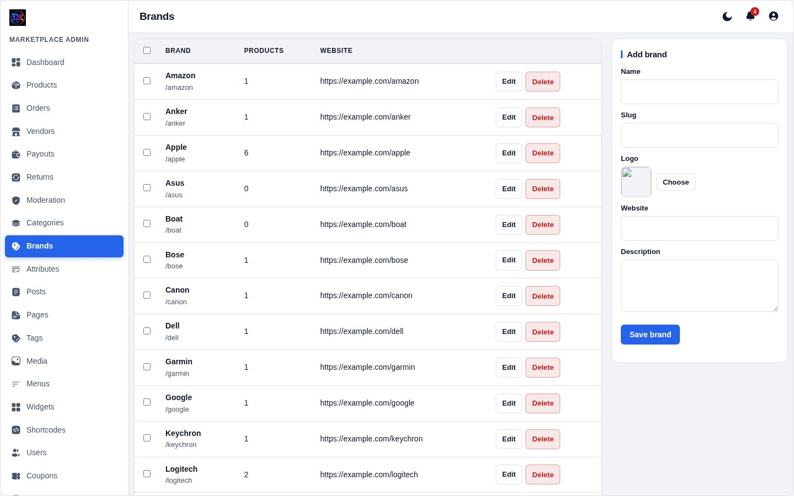
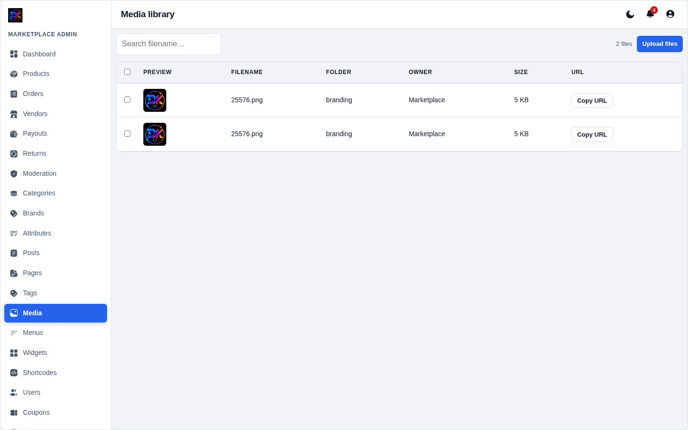
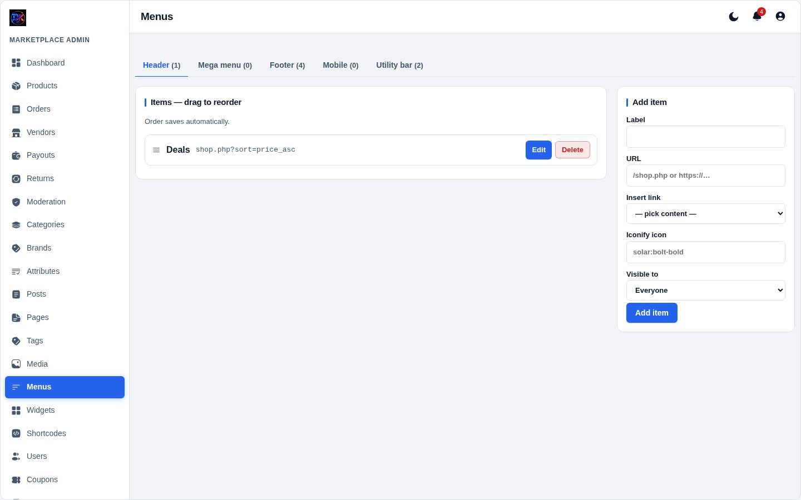
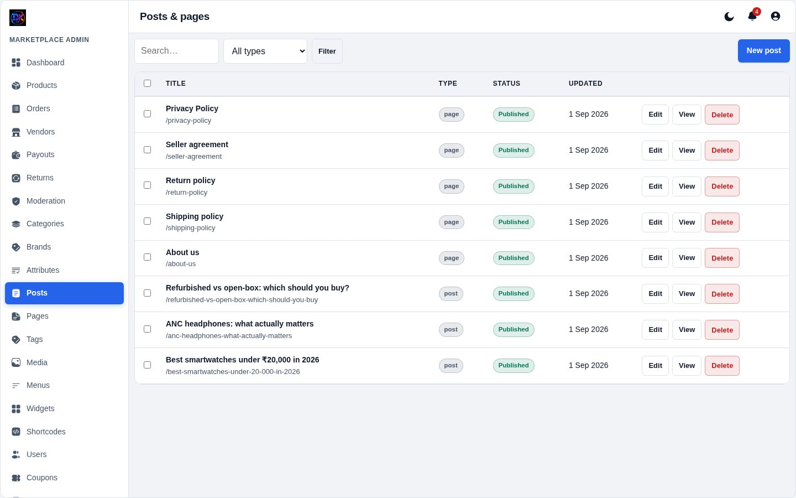

[← Docs index](README.md)

# 6 — Storefront content

## Banner slider

The rotating carousel at the top of the homepage. Images only — no text
overlays, because overlaid text never survives the crop to a phone screen.

**1 — Existing banners** in display order, with a live/off pill.
**2 — Image field.** Pick from the media library or upload.

| Field | Notes |
|---|---|
| **Title** | Internal only, never shown on the slide |
| **Desktop image** | **1600×420** recommended |
| **Mobile image** | **800×500** — upload one, or phones get a letterboxed crop |
| **Link** | Where the slide goes, e.g. `shop.php?cat=smartphones` |
| **Sort order** | Lower shows first |
| **Starts / Ends** | Optional schedule — outside the window it hides itself |
| **Live** | Master on/off |

The slider auto-advances every 5 seconds, pauses on hover, supports swipe, and
respects `prefers-reduced-motion`.

## Categories

Categories drive the nav, the homepage rail and the shop filters.

| Field | Notes |
|---|---|
| **Name / slug** | Slug becomes `/c/your-slug` |
| **Icon** | An [Iconify](https://icon-sets.iconify.design/solar/) name like `solar:smartphone-bold` |
| **Commission rate** | Overrides the site default for products in this category |
| **Sort order** | Position in the nav |
| **Description** | Shown on the category page, used as its meta description |

## Brands

Name, slug, logo and website. Brands appear as a filter facet, on the product
card, in the homepage brand rail, and in the product's structured data.

## Media library

Everything ever uploaded. Search by filename, filter by folder, and **Copy
URL** gives you the full absolute URL (not a relative path), so it works when
pasted anywhere.

## Menus

Build the header and footer menus. Drag to reorder, nest one level for
dropdowns. Items can point at a category, a page, a product or a custom URL.

## Pages and blog

**Pages** are static content — About, Privacy, Returns Policy. **Posts** are
the blog / buying guides.

Both use the same editor as products, including the Visual/HTML toggle and the
AI writer, and both get their SEO generated automatically.

Blog cards on the storefront are deliberately styled differently from product
cards — wide 16:9 image, reading time, "Read guide" link — so the homepage does
not read as one endless grid.

## Widgets and shortcodes

**Widgets** fill the sidebar and footer blocks. **Shortcodes** let you define a
snippet once (say a shipping table) and drop `[my-snippet]` into any page or
product description.

---

[← Vendors & payouts](05-vendors-payouts.md) · [Next: Coupons & shipping →](07-coupons-shipping.md)
