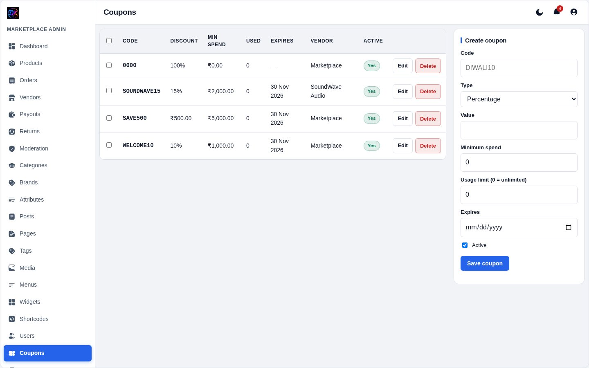
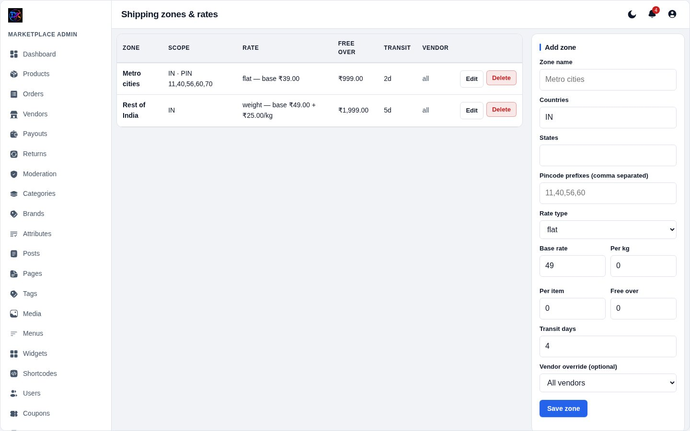

[← Docs index](README.md)

# 7 — Coupons & shipping

## Coupons

| Field | Notes |
|---|---|
| **Code** | What the buyer types. Matched case-insensitively |
| **Kind** | `percent` or `fixed` |
| **Value** | `10` = 10% off, or ₹10 off, depending on kind |
| **Min spend** | Cart subtotal must reach this |
| **Vendor** | Leave blank for site-wide, or tie it to one seller |
| **Usage limit** | `0` = unlimited |
| **Expires** | Last valid day |
| **Active** | Master on/off |

Buyers apply codes in the cart. The totals update over AJAX without a reload,
and the discount is recalculated **server-side** at checkout — a tampered
client cannot change the price.

A vendor-specific coupon only discounts that seller's items in a mixed cart.

## Shipping

Shipping is **zone + rate**.

**Zones** group pincodes or states — e.g. *Metro*, *Rest of India*,
*North-East*.

**Rates** within a zone can be:

| Type | Behaviour |
|---|---|
| Flat | One price per package |
| Weight-based | Price per kg, using variant weights |
| Free above | Free once the package subtotal passes a threshold |

Rates apply **per package**, so each seller's shipment is costed separately —
which is what the buyer sees in the cart.

**Handling days** on a product feed into the delivery estimate. The product
page's *Check delivery* box combines the buyer's pincode, the zone, and the
handling time to produce the date range.

### A product that always ships free

Tick **Free shipping** in the product editor. It overrides the zone rate for
that item.

---

[← Storefront content](06-content.md) · [Next: Settings →](08-settings.md)
