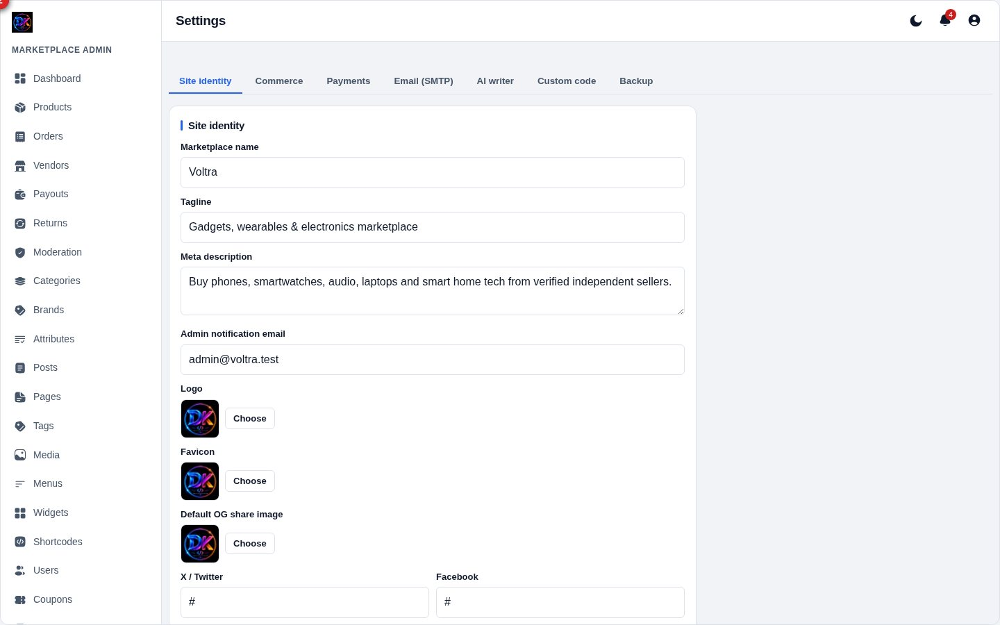
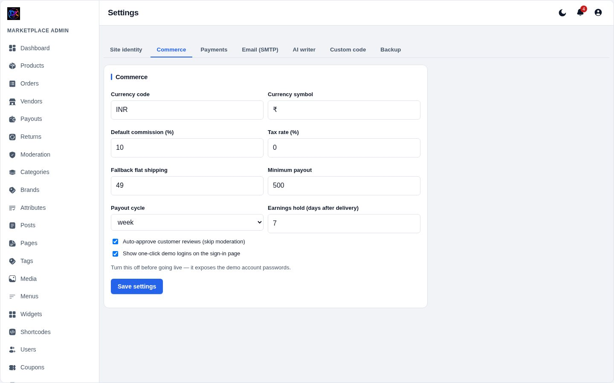
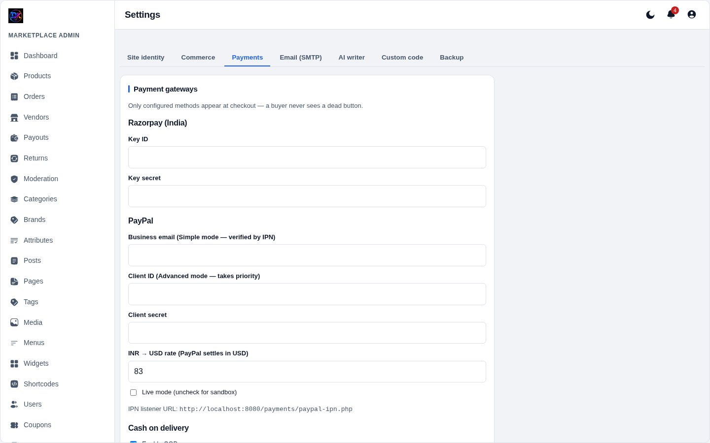
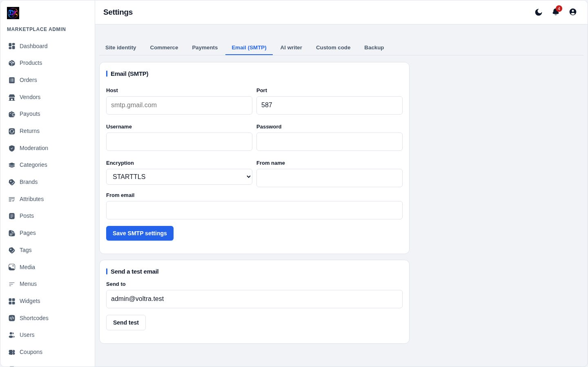
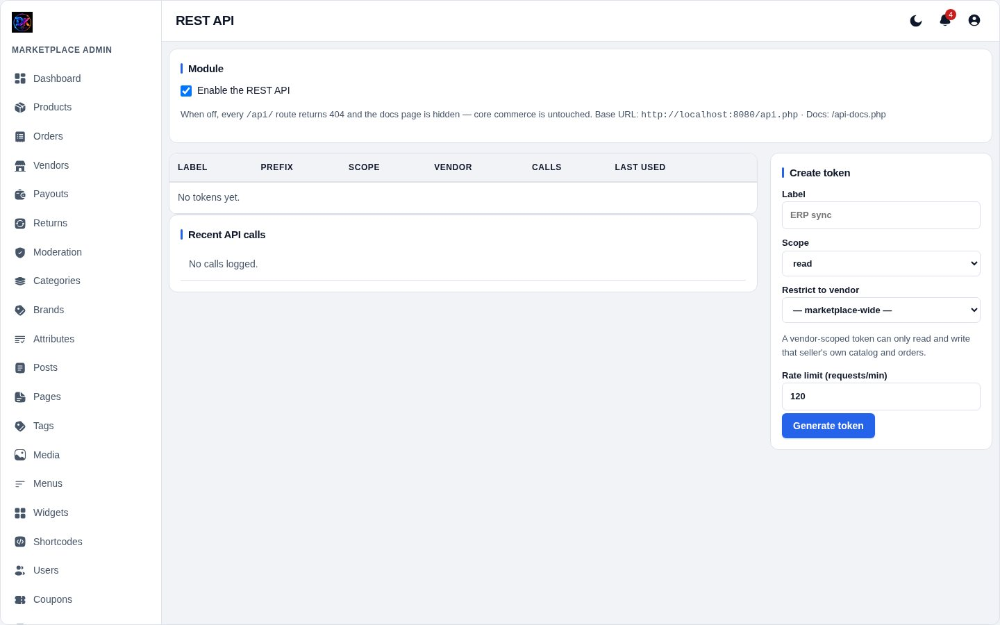

[← Docs index](README.md)

# 8 — Settings

Seven tabs. Each saves independently.

## Site identity

**1 — Logo.** Replaces the icon + wordmark in the header, footer and admin
sidebar. Constrained by height (34px header, 30px footer), so any aspect ratio
fits. In dark mode it is auto-inverted so a dark logo does not vanish.

**2 — Favicon.** The browser tab icon. PNG, SVG and ICO all work — the MIME
type is detected from the extension.

Also here: site name, tagline, default social share image, and your social
profile links. A social link left blank is **not rendered** — no dead `#`
links in the footer.

## Commerce

| Setting | Notes |
|---|---|
| **Currency** | Symbol and code used everywhere |
| **Default commission %** | Your cut. Categories and vendors can override it |
| **Minimum payout** | Sellers below this are not listed on the payouts page |
| **Payout cycle** | Weekly / fortnightly / monthly — guidance only |
| **Earnings hold (days)** | Days after delivery before funds become available |
| **Default role** | What new signups become |
| **Auto-approve reviews** | Skip moderation for customer reviews |
| **Demo logins** | **Turn this off before going live** |

## Payments

**Razorpay** — key ID and secret. Signatures are verified server-side with
`hash_equals`.

**PayPal** — client ID and secret, plus a **Live mode** tick (leave unticked
for sandbox). Captures are confirmed with a server-side Orders API call.

**COD** — on/off. COD earnings are credited to the seller only on delivery.

> A browser redirect back from a gateway is never trusted on its own. Payment
> is confirmed server-to-server before an order is marked paid.

## Email (SMTP)

Host, port, username, password, encryption (STARTTLS / SSL / none), and the
from name and address. The SMTP client is dependency-free — no PHPMailer.

Emails sent: order confirmation, shipment with tracking, delivery, refund,
password reset, vendor application result, payout recorded.

Use **Send test email** after saving. If it fails, check the port (587 for
STARTTLS, 465 for SSL) and whether your host blocks outbound SMTP.

## AI writer

Paste a Groq API key to enable the **AI writer** button in the editors. It
drafts product descriptions and blog posts from a short prompt. Leave the key
blank and the button simply does not appear — nothing else changes.

## Custom code

Inject `<head>` code (analytics, verification tags) and end-of-body code. Added
verbatim to every storefront page. Admin pages are unaffected.

## API tokens

Optional REST API. Create a token (`vlt_` + 40 hex, shown once), give it
`read` or `read+write` scope, and optionally lock it to a single vendor.

Only the SHA-256 hash is stored, so a lost token cannot be recovered — revoke
and reissue. There is a per-minute rate limit; exceeding it returns **429**.
Docs generate themselves at `/api-docs.php`.

## Backup

Covered in [Backup & restore](11-backup.md).

---

[← Coupons & shipping](07-coupons-shipping.md) · [Next: Vendor panel →](09-vendor-panel.md)
