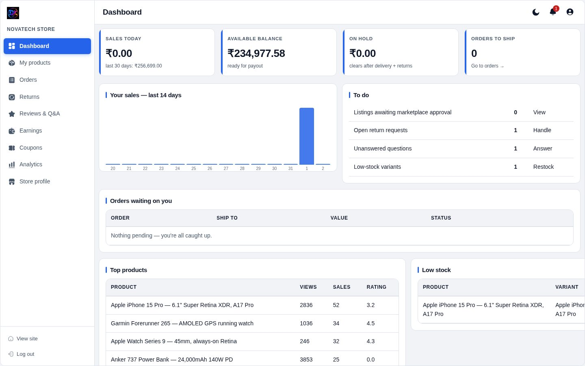
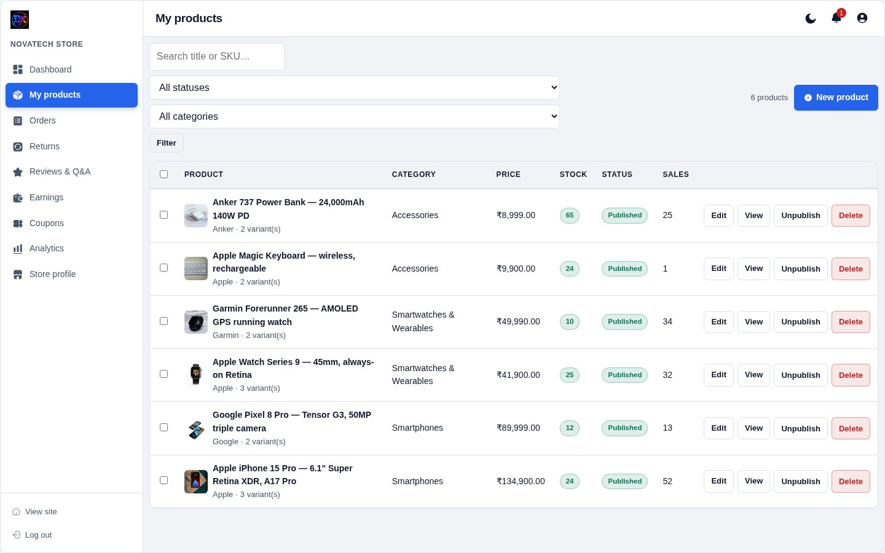
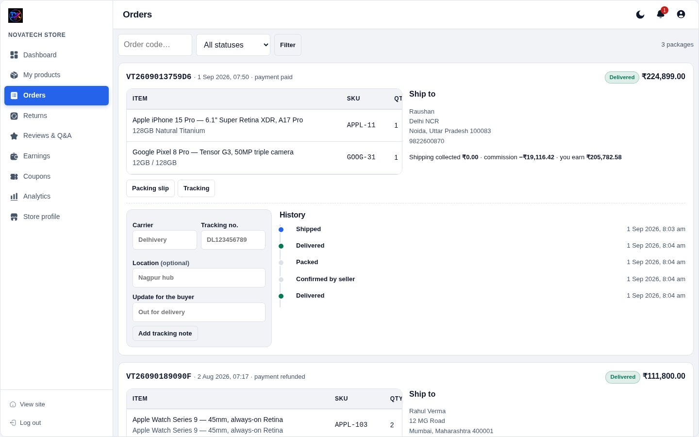
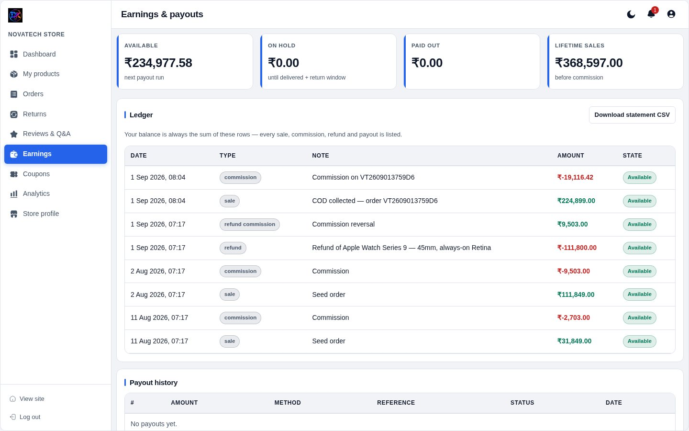
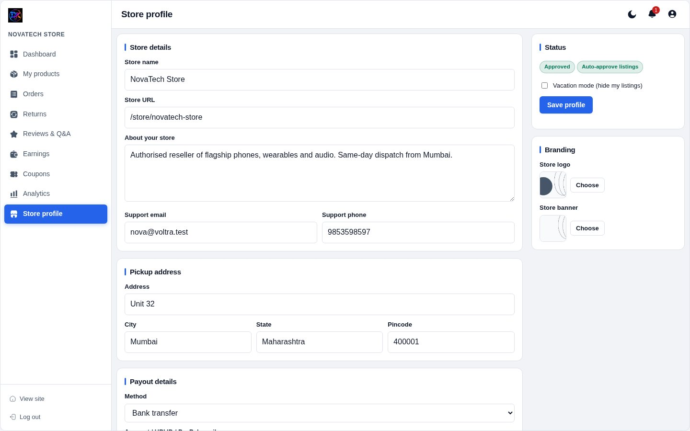

[← Docs index](README.md)

# 9 — Vendor panel

What your sellers see at `/vendor/`. Everything is scoped to their own store —
enforced server-side, on every page and every AJAX call.

## Dashboard

Their sales, orders awaiting action, current balance and recent activity. Same
layout language as the admin, but only their own numbers.

## Products

Their catalogue only. They add and edit products with the **same editor** the
admin uses — variants, SKUs, images, Visual/HTML toggle, the lot.

If **auto-approve** is off for this vendor, a new product is saved as *Pending*
and appears in your Moderation queue. If it is on, they publish directly.

## Orders

Only packages belonging to them. They update shipment status, carrier and
tracking through the same form you use — and those updates land in the same
append-only timeline the buyer sees.

A vendor requesting another vendor's package gets a **403**.

## Earnings

Pending, available and paid-to-date, plus every ledger line. Because this reads
the same `vendor_ledger` table as your payouts page, your figures and theirs
can never disagree.

## Store profile

Store name, bio, logo, banner, support contact, address and payout details.
This is what buyers see on the storefront at `/store/their-slug`.

## Also available to vendors

- **Reviews & Q&A** — reply to reviews and answer product questions
- **Returns** — handle RMA requests for their items
- **Coupons** — create discount codes for their own products only
- **Analytics** — views, add-to-carts and purchases for their catalogue

---

[← Settings](08-settings.md) · [Next: SEO →](10-seo.md)
