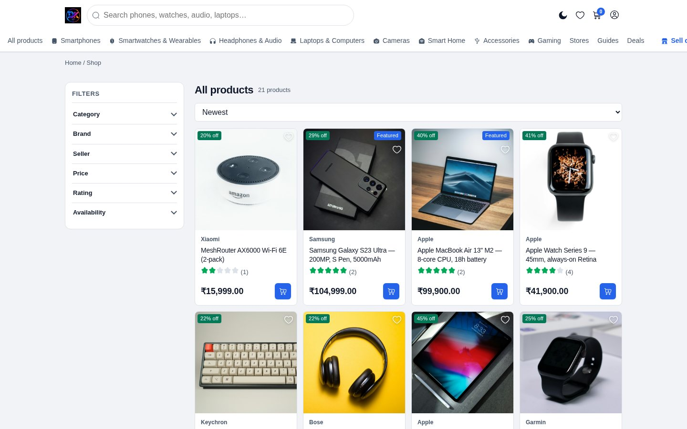

[← Docs index](README.md)

# 10 — SEO

## There are no SEO fields

You will not find a "meta title" or "meta description" box anywhere. Everything
is derived from the content you already wrote, in `includes/seo.php`.

| Tag | Comes from |
|---|---|
| `<title>` | Product/post title + site name |
| `meta description` | Short description → body → auto-generated from the facts |
| `canonical` | The clean URL, with tracking params stripped |
| Open Graph + Twitter | Title, description, featured image (absolute URL) |
| JSON-LD | Built from the record — see below |

Write a good title and short description and the rest follows.

## Structured data

| Page | Schema emitted |
|---|---|
| Product | `Product` with price, stock, brand, rating, seller, return policy |
| Multi-variant product | `AggregateOffer` with low/high price |
| Blog post | `Article` with author and dates |
| Store | `Store` with address |
| Every page | `Organization` + `BreadcrumbList` |

Test any page with [Google's Rich Results Test](https://search.google.com/test/rich-results).

## URLs

Clean paths, not query strings:

| Page | URL |
|---|---|
| Product | `/product/apple-iphone-15-pro` |
| Blog post | `/blog/best-smartwatches-2026` |
| Store | `/store/novatech-store` |
| Category | `/c/smartphones` |
| Brand | `/brand/apple` |

Old `?slug=` URLs **301 redirect** to the clean version, so a page is never
indexable at two addresses.

> Changing a slug after publishing changes the URL and the old one 404s. Set
> the slug before you publish.

## Filtered pages

Shop pages with a filter applied, and page 2 onwards, are automatically
`noindex,follow`. Facet combinations would otherwise flood the index with
near-duplicate pages. Links are still crawled, so products stay discoverable.

## Sitemap and robots

- `/sitemap.xml` — generated live from published content, clean URLs only
- `/robots.txt` — generated, points at the sitemap

Submit `https://yourdomain.com/sitemap.xml` in Search Console.

## Accessibility

Every page scores **zero WCAG 2 A/AA violations** under axe-core, on desktop
and mobile. That matters for SEO too — labelled controls and sufficient
contrast are ranking-adjacent signals, and Lighthouse reports them.

---

[← Vendor panel](09-vendor-panel.md) · [Next: Backup & restore →](11-backup.md)
