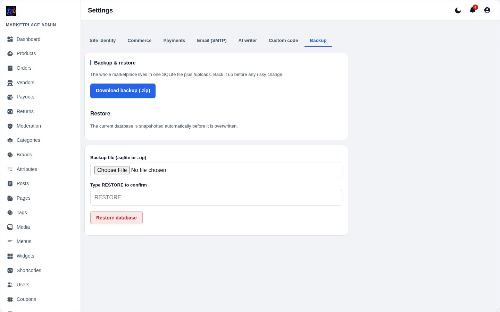

[← Docs index](README.md)

# 11 — Backup & restore



**Settings → Backup**

## Taking a backup

**Download backup** gives you a `.zip` containing the database — tick the
option to include `uploads/` as well.

If your host lacks the `zip` extension you get the raw `.sqlite` file instead.
That is equally valid; it just is not compressed.

**Back up before:** upgrading, bulk-importing, editing anything in `db/`, or
any change you are unsure about.

## Restoring

1. Choose your backup file (`.zip` or `.sqlite`).
2. Type **`RESTORE`** in the confirm box.
3. Click **Restore database**.

Two safety nets:

1. **The current database is snapshotted first**, alongside the live file.
2. **The upload is validated before anything is overwritten.** It is staged,
   checked that it really is SQLite and contains the core tables, and only then
   swapped in. A bad file is rejected and your live site is untouched.

> Restoring replaces **all** data — products, orders, vendors, settings. It
> cannot be undone except by restoring another backup.

## What is protected

`db/` is blocked at the web server by `.htaccess`, plus a rule denying
`.sqlite`, `.sqlite-wal`, `.sqlite-shm`, `.backup` and `.sql` files anywhere.
Requesting `/db/voltra.sqlite` returns **403**.

PHP execution is also disabled inside `uploads/`, so an uploaded `.php` file
cannot be run.

## Manual backup

The database is a single file. Over SSH:

```bash
cp db/voltra.sqlite ~/backups/voltra-$(date +%F).sqlite
tar czf ~/backups/uploads-$(date +%F).tar.gz uploads/
```

A nightly cron job doing exactly that is a perfectly good backup strategy.

---

[← SEO](10-seo.md) · [Next: Troubleshooting →](12-troubleshooting.md)
